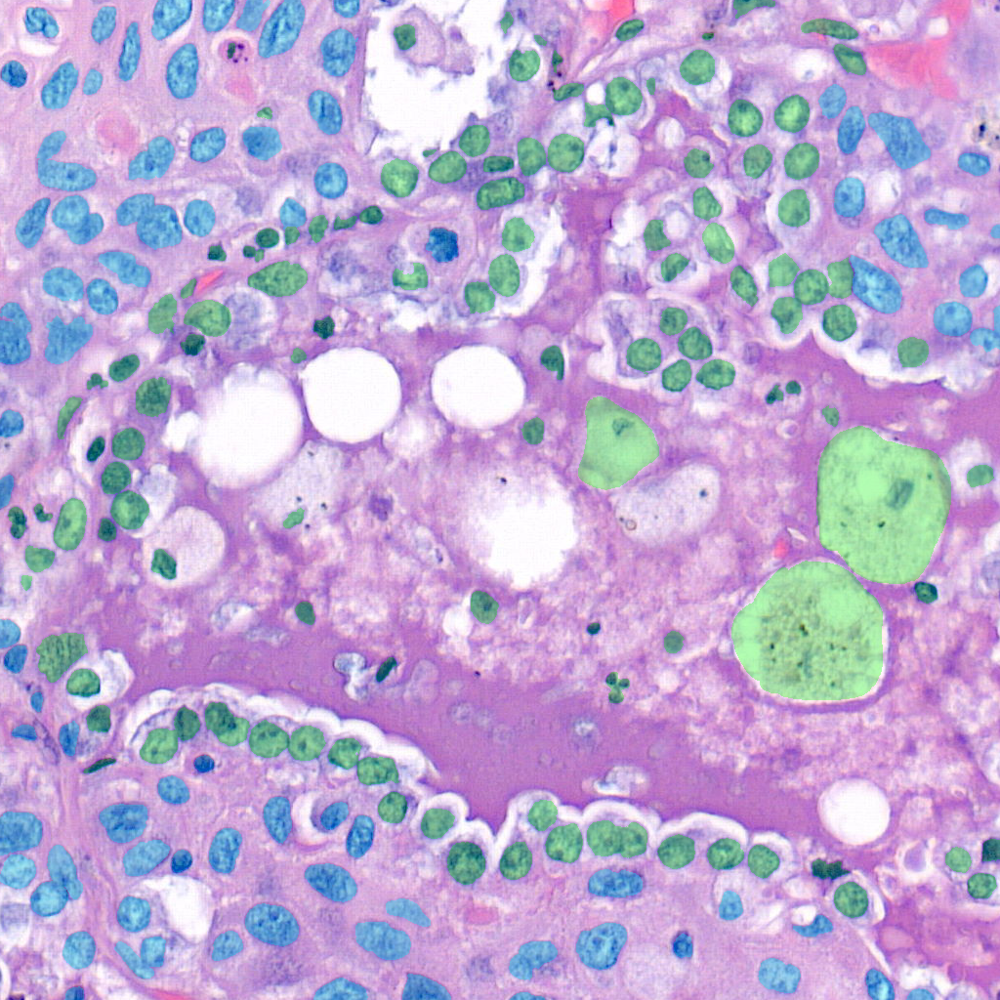
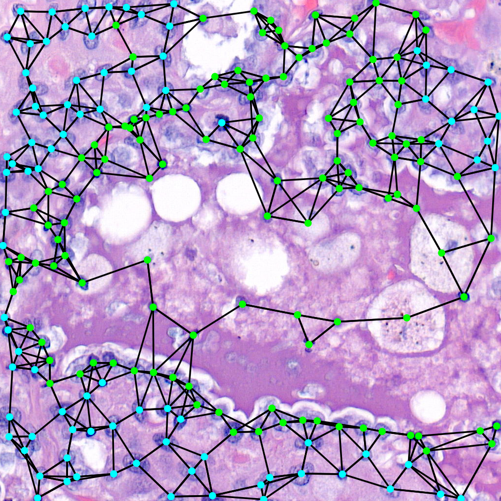

.. tumourkit documentation master file, created by
   sphinx-quickstart on Thu Mar 23 08:23:33 2023.
   You can adapt this file completely to your liking, but it should at least
   contain the root `toctree` directive.

Welcome to tumourkit's documentation!
=====================================

.. toctree::
   :maxdepth: 3
   :hidden:

   Home page <self>
   installation
   usage
   contribute
   API reference <_autosummary/tumourkit>

|pic1| |pic2| |pic3|

This project is created with the idea of helping researchers accelerate their work. 
It was born from a need to automate many repetitive tasks that were being done every day like converting from 
one data format to another, or performing hyperparameter tuning of a model. This library is supposed 
to simplify that process into three commands which are explained in :doc:`usage`.
It implements a method which uses convolutional neural networks and graph neural networks.
You can also visualise the process as shown above. More on that on the :ref:`visualisation section<viz>`.

.. note::

   This project is under active development.
