Usage
=====

If you haven't installed the library yet, check out the :doc:`installation` section for further information.

Entry points
------------

Once you have installed the library several commands will be made available in the shell. The most important ones are:

* :code:`make_dirs`: It will create an internal directory structure where all the magic is going to happen. More info :ref:`below <make_dirs>`.
* :code:`run_training`: It will train the segmentation and classification models sequentially. More info :ref:`below <run_training>`.
* :code:`run_inference`: It will execute the pipeline on previously unseen images. More info :ref:`below <run_inference>`.
* :code:`run_evaluation`: It will evaluate Hovernet and GNNs after training. More info :ref:`below <run_evaluation>`.

They all require some parameters to be specified. You can get the parameter names and a brief description by calling the commands together with the flag :code:`-h` or :code:`--help`.

There are more commands available, for a comprehensive list look in the :ref:`corresponding section <preproc_utils>`.

.. _make_dirs:

make_dirs
^^^^^^^^^

There are many data formats that need to be handled during training. And model weights also need to be located somewhere.
To avoid moving objects around and keep everything organized, a strict folder structure is enforced, and it looks like what follows.

::

    root-folder
    ├── data
    │   ├── orig
    │   ├── train
    │   │   ├── centroids
    │   │   ├── gson
    │   │   ├── json
    │   │   ├── png
    │   │   ├── csv
    │   │   ├── graphs
    │   │   |   ├── raw
    │   │   |   ├── GT
    │   │   |   └── preds
    │   │   └── npy
    │   ├── test
    │   │   ├── ...
    │   └── validation
    │       ├── ...
    └── weights
        ├── classification
        |   ├── automl
        |   ├── xgb
        |   └── gnn
        │       ├── conf
        │       ├── normalizers
        │       └── weights
        └── segmentation
            └── hovernet
                └── type_info.json

Keep in mind throughout the whole process that the parameter :code:`--num-classes` must be specified always. 
Here it is responsible for creating the correct :code:`type_info.json` which contains needed information for hovernet to classify in the number of classes you specify. 

Once you have created that structure, you must move all your original tiles to :code:`data/orig` and the geojson files to :code:`data/train/gson`, :code:`data/validation/gson` or :code:`data/test/gson` depending on the split they belong to. 
That is enough for the pipeline to proceed. If your labels don't come from QuPath and don't have a geojson format, you will need to convert whatever format you have to the geojson format first. 
For more details on how to do so, go to :ref:`the format conversion section <preproc_utils>`.

.. _run_training:

run_training
^^^^^^^^^^^^

Now that everything is set up, you can begin training the models. The corresponding command is

.. code-block:: console
   
   $ run_training --root-dir [...] --pretrained-path [...] --num-classes 2 --gpu 0 --num-workers 10

Here you need to specify two main parameters: :code:`--root-dir` and :code:`--pretrained-path`. The first one is the root folder specified on the previous section. 
The second is the path to the weights you want your hovernet model to start with. The original hovernet models can be found in the `drive <https://drive.google.com/drive/folders/17IBOqdImvZ7Phe0ZdC5U1vwPFJFkttWp>`_ 
of the original `repository <https://github.com/vqdang/hover_net>`_. Right now, the pipeline is designed to work with the :code:`hovernet_original_consep_type_tf2pytorch.tar` checkpoint.

The other parameters are computational parameters. They indicate in which gpu id to execute the models and how many threads to use in the parts which are parallelized, mainly preprocessing and postprocessing functions.

During training, hovernet logs are saved in :code:`root-dir/weights/segmentation/hovernet/` and graph neural network logs in :code:`root-dir/gnn_logs/`. 
For a detailed explanation of what you can find and how to visualize them, go to :ref:`the relevant section <logs>`.

Keep in mind that training the hovernet model with a field of view of 518 pixels by side requires around 20-24GB of GPU RAM.
You can modify the code to use a smaller field of view of 270, but it will probably yield worse results.
Apart from that, the space occupied by the checkpoints and other data inside the root directory can reach up to 50GB of disk space.
Also, for a dataset of about one hundred images it can take up to 20 hours to train. Be prepared. 

After version 0.8.0 another parameter was added called :code:`--enable-background`. This parameters enables a different way of training.
If it is set, GNNs have an extra head to predicted whether a given predicted cell is potentially not a cell, therefore correcting some Hovernet mistakes.
This flag is present in all the commands, keep in mind that a model trained with this flag on, must also have it enabled on inference and evaluation.

.. _run_inference:

run_inference
^^^^^^^^^^^^^

After you have trained your models, you may want to predict new labels for previously unseen images. To do so, just execute the following

.. code-block:: console
   
   $ run_inference --root-dir [...] --input-dir [...] --output-dir [...] --best-arch [...] --num-classes 2 --gpu 0 --num-workers 10

The parameters :code:`--input-dir`, :code:`--output-dir` indicate where the input images are, and where to save the results. If the indicated folder does not exists, it is created. 
Be careful, whatever is in the folder will be overwritten.

The remaining parameter :code:`--best-arch` indicates which graph architecture has been used. Right now it only supports GCN. You will also see that this command 
has more parameters. The rest of the parameters make reference to hyperparameters of the graph neural network. However, you can simply choose the combination 
that was best in validation and test while training by not specifying them. Also, if you specify a combination of hyperparameters that was not used during 
training, it will not work.

If you find that hovernet is breaking cells into parts, we provide an algorithm to solve that. For more information go to :ref:`the relevant section <merge_cells>`.

Be aware that you will need at least 10GB of RAM in order to execute the hovernet model. The rest of the pipeline works smoothly on CPU, but the hovernet model requires heavy computation.
It should take only a few seconds for the hovernet to process one image and less than a minute per image for the whole pipeline. Obviously, it depends on your hardware.

.. _run_evaluation:

run_evaluation
^^^^^^^^^^^^^^

To evaluate the performance of a given model in the test set you can use this command

.. code-block:: console

   $ run_evaluation --root-dir [...] --save-dir [...] --num-classes 2 --debug --best-num-layers [...] --best-dropout [...] --best-norm-type [...] --best-arch [...]

In the save directory you will have the metrics computed taking into account perfect 1-1 matching and including the background as a class.
The last one normally has the suffix 'bkgr'. When :code:`--debug` is enabled confusion matrices are also saved.
If :code:`--best-arch` is not provided, the best configuration is estimated from the training logs.

There are also two extra commands to obtain visualizations from the validation logs of tensorboard computed during training. 

.. code-block:: console

   $ extract_tensorboard --logs-dir gnn_logs/  --output-path gnn_logs
   $ plot_logs --input-path gnn_logs.csv --output-dir gnn-plots/

This will create line charts for analyzing the effect of batch normalization and boxplots for the effect of the dropout, like the examples below.

|pic1-f1| |pic2-f1|

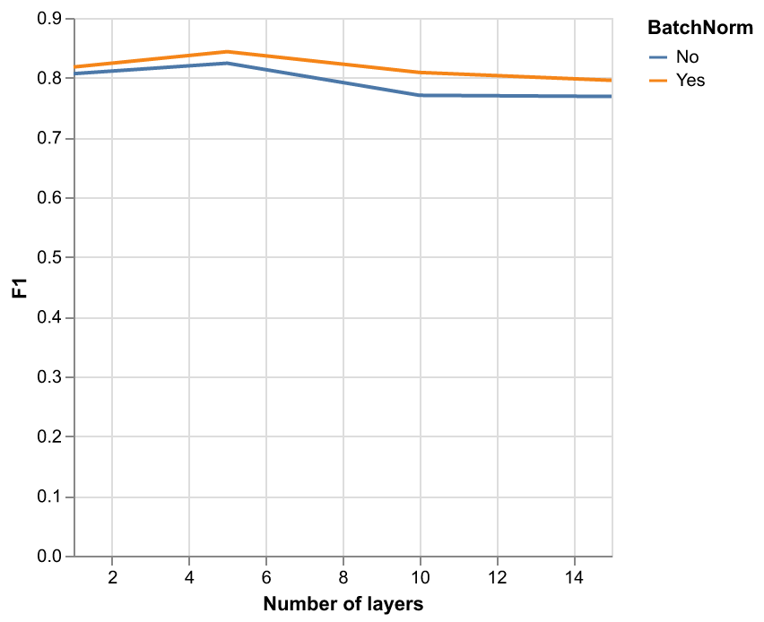

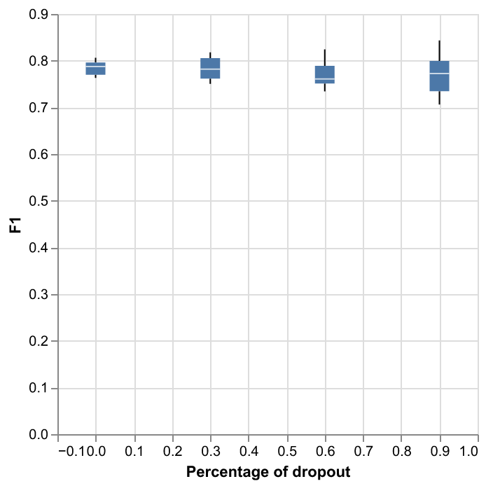

.. _run_research:

run_research
^^^^^^^^^^^^^

This command is provided in case you want to reproduce the experiments from my bachelor's or masters's thesis. The command is as follows:

.. code-block:: console

   $ run_research --root-dir [...] --output-dir [...] --experiment [...] --pretrained-path [...] --num-classes [...] --gpu 0 --num-workers 10

It works quite similar as the two commands above. In the output directory everything will be saved, from logs to newly trained models. 
From my bachelor's thesis there are three different experiments available to choose: scaling, void-gnn, xgb-gnn.
For more information on what do the experiments represent, you can read my thesis. 

From my master's thesis there is one experiment available: early-topo.
This experiment trains several GNNs in the same way as the other experiments but it uses the neural persistence as a stopping criterion.
The neural persistence is computed from the network weights using either Vietoris-Rips complexes of all the weights as 1D points,
or using cubical complexes and considering matrices as images. 
Both training runs will be saved in the output directory and results can be visualized with tensorboard.
The experiment can be run like this:

.. code-block:: console

   $ run_research --output-dir [...] --experiment early-topo

With respect to compute power needed, except for the scaling one they are all lighter than the run_training pipeline. The xgb-gnn can even be done in the CPU in less than half an hour. 
An the void-gnn can also be done in CPU if needed. The scaling experiment trains four different hovernet models with different fields of view. 
For the 270 models it needs less than 10GB GPU RAM while for the 518 models it requires at least 20GB RAM.

If you downloaded the dataset from `Zenodo <https://zenodo.org/records/8368163>`_, make sure to have the dataset inside folder :code:`.internals/` and renamed with name :code:`data` instead of :code:`lung-tumour-study`.

.. _preproc_utils:

Format conversion
^^^^^^^^^^^^^^^^^

When working with patches of whole slide images, the labels can be represented in two main formats:

* **PNG <-> CSV**: This is the standard format for instance segmentation where every cell has an identifier. In the image (PNG) every pixel has the value of that identifier and in a separate table (CSV) each identifier has associated one class. The classes are numbered from 1 to C, being C the number of classes. And the ID 0 is reserved for the background.
* **GeoJSON**: This is the format used in the QuPath program that can be used for labelling the images. It is a standard geojson format where the geometry describes the contours of the cells and in the properties attribute is included the class of the cell.

Apart from those two formats there are other three formats storing additional information:

* **.centroids.csv**: For evaluation purposes the centroids of the cells are precomputed and stored as a table (CSV) with the columns X, Y and class.
* **Hovernet JSON**: The output of the hovernet model comes with a JSON that has extra information like the position of the centroids or the contours that is quite handy.
* **Hovernet npy**: The format of the input to hovernet. Basically images with 5 channels: Red, Green, Blue, segmentation and classification.

There is yet another format for storing graph nodes:

* **.nodes.csv**: Stores extracted attributes of cells and saves them in a csv. Current attributes are: (X,Y) center of bounding box, area, perimeter, gray level variance and RGB histogram. Apart from morphological attributes, the probabilities of each class from hovernet prediction are also given as attributes.

In order to convert from any format to any format, several commands are provided by this library:

* :code:`geojson2pngcsv`: To convert from GSON to PNG / CSV.
* :code:`pngcsv2geojson`: To convert from PNG / CSV to GSON.
* :code:`pngcsv2centroids`: To compute centroids form PNG / CSV format.
* :code:`pngcsv2graph`: To compute the node centroids and attributes from PNG / CSV and original tiles.
* :code:`hovernet2geojson`: To convert from JSON to GSON.
* :code:`hovernet2centroids`: To extract centroid information from JSON.
* :code:`centroids2png`: To create images with pixel value 255 at the centroids coordinates.
* :code:`graph2centroids`: To extract centroids from the .nodes.csv files.
* :code:`centroidspng2csv`: To obtain CSV labels from centroids labels and PNG segmentation.

The last two commands are needed to convert from the graph format back to the PNG / CSV format. Each of them has specific parameters. 
To get an explanation of what parameters are needed run the commands with the :code:`-h` or :code:`--help` flags.

In case you want a more in depth explanation of the code that is being executed under the hood, please refer to the :doc:`API reference <_autosummary/tumourkit>`.

.. _merge_cells:

Merge cells
^^^^^^^^^^^

The segmentations produced by Hovernet tend to split cells in half sometimes. This library provides an algorithm to merge broken cells.
If we have a situation like in the image below.

.. image:: imgs/morph1.png
  :width: 400
  :alt: Cells computed by hovernet.

The algorithm would merge the parts like this.

.. image:: imgs/morph2.png
  :width: 400
  :alt: Aftermath of applying the algorithm.

To apply this algorithm to a set of labels call it with this command.

.. code-block:: console
   
   $ merge_cells --png-dir [...] --csv-dir [...] --output-path [...]

The two first arguments indicate the input in PNG / CSV format, and the last one is the folder to save the result. 
Two subfolders will be created under it called postPNG and postCSV containing the new PNG / CSV files.

.. _logs:

Tensorboard logs
----------------

Examples
^^^^^^^^

During the two hovernet phases, images are being shown after every epoch containing the output of each branch. 
You can see such an example below.

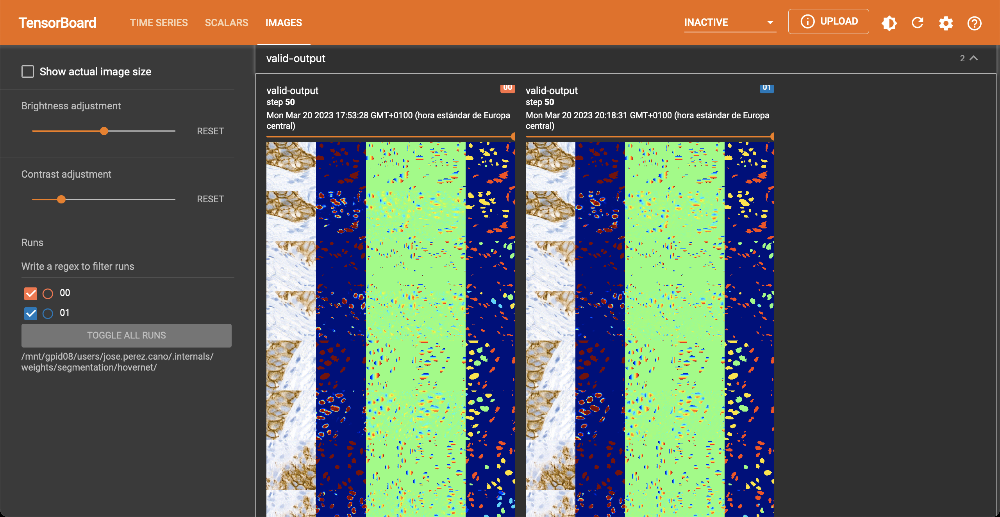

In the scalar tab there are several metrics being reported as well. 

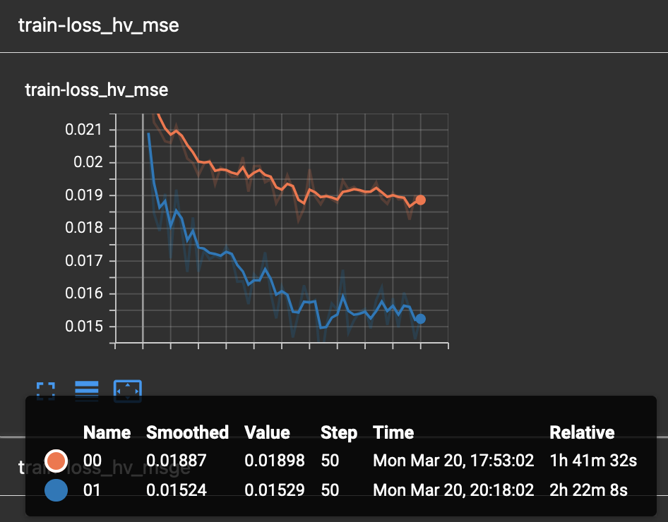

Once Hovernet has finished training and the graph methods have started, you will be able to see something like this.

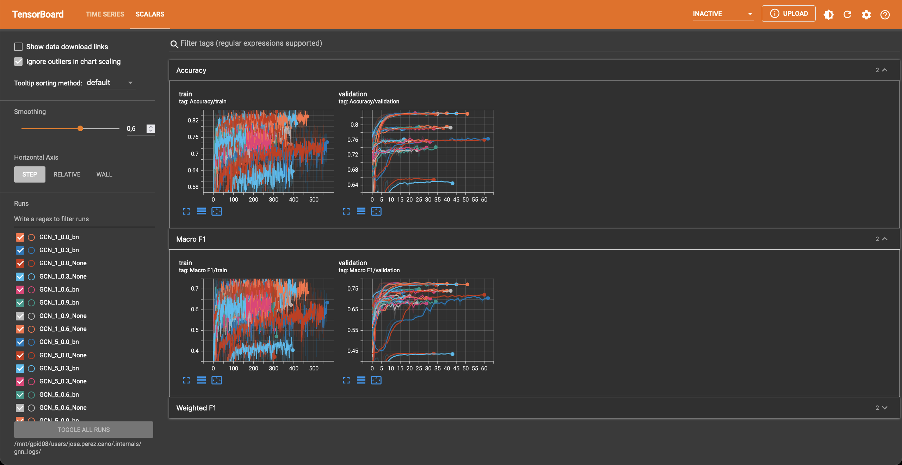

Where three different metrics are shown. Depending on whether the problem is binary or multiclass you will observe different metrics. 
In this part of the pipeline different configurations are being tried, as you can see, the performance varies wildly depending on the hyperparameters.

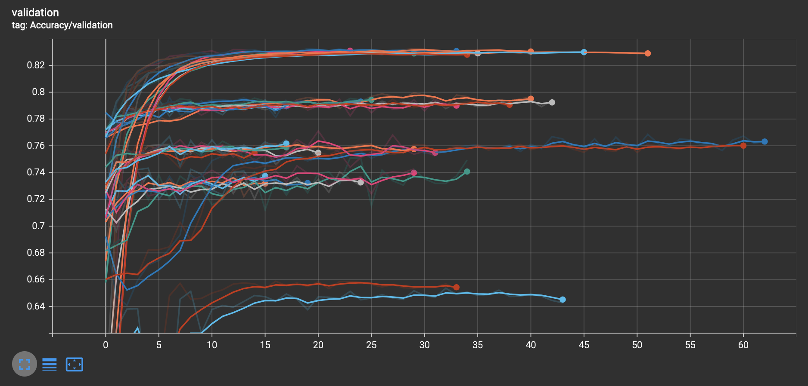

Instructions
^^^^^^^^^^^^

In order to obtain the visualizations from the previous section you will have to run a tensorboard session. 
Tensorboard is listed as one of the dependencies of this library, so you don't need to install anything else, just run the appropiate command.

.. code-block:: console

    $ tensorboard --logdir [...]

This will host a page in :code:`localhost:6006` containing all the relevant logs. Just open a browser and you will be able to see them. 
The hovernet logs are located in  :code:`root-dir/weights/segmentation/hovernet/` and the graph neural network logs in :code:`root-dir/gnn_logs/`.

If you are running the tensorboard session on a headless server that is accessed by ssh, you will need to redirect ports to view the page.
To do so, run in your local machine (not the server) this command

.. code-block:: console

    $ ssh -L  6006:localhost:6006 -Nf [HOST ADDRESS] &

where the host address is the direction you use to access the server by ssh. 
If you want to change the port it is redirected to, change the first 6006 to whatever you find convenient.

If you want to extract the values of the validation metrics after training there is a command for that:

.. code-block:: console

   $ summarize_logs --input-dir [...] --output-path [...] --patience [...]

This can be useful when you want to measure correlation between validation proxy metrics and the test metrics.

.. _gradio:

Gradio demo
-----------

If you want to try the models from my thesis on new images you can do so in the Gradio app this library provides.
To run it locally execute the following command: 

.. code-block:: console

    $ start_app --ip localhost --port 15000

If you have a GPU it will use it and if you don't everything will be run on the CPU.
Inference of one image on the CPU takes more than ten minutes. And for the GPU you may require at most 10GB of RAM.
In case you want to run it in an server just change the ip to 0.0.0.0

.. code-block:: console

    $ start_app --ip "0.0.0.0" --port 15000

Or if you want to share with other people, Gradio provides a free shareable ip for 72 hours. 
To invoke it add an extra flag like this:

.. code-block:: console

    $ start_app --ip localhost --port 15000 --share

Once you open the link in the server you should see something like this.

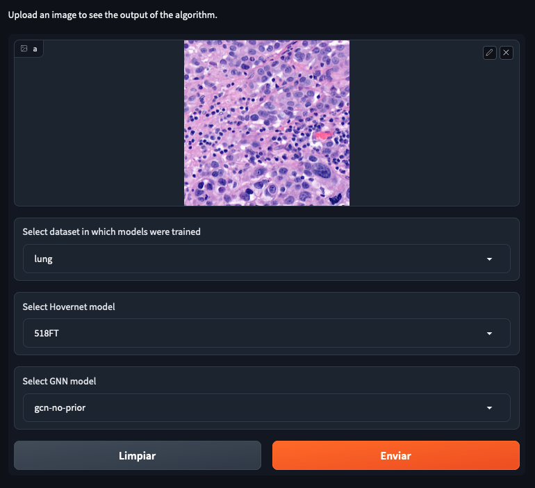

You can select 4 different datasets, with 4 different hovernet models each and 6 different graph models. 
The name of the hovernet model indicates the field of view and FT means that it was fine-tuned from a previously trained checkpoint, 
otherwise it was trained from scratch. In my thesis we found that 518FT was normally the best. 
The graph models provided operate on different sets of features. No prior means that it doesn't use the hovernet probabilities. 
No morph means no visual features are used. Void means no features at all. And full means using both probabilities and morphological features. 
For all except monusac I also provide the graph attention network in full mode. You can also find the checkpoint on `Hugging Face <https://huggingface.co/Jerry-Master/Hovernet-plus-Graphs/tree/main>`_.

.. _viz:

Visualisations
--------------

Overlay cells on top
^^^^^^^^^^^^^^^^^^^^

If you want to visualise what is happening at each step you can do alpha compositing with the predicted cells to obtain an image similar to this:

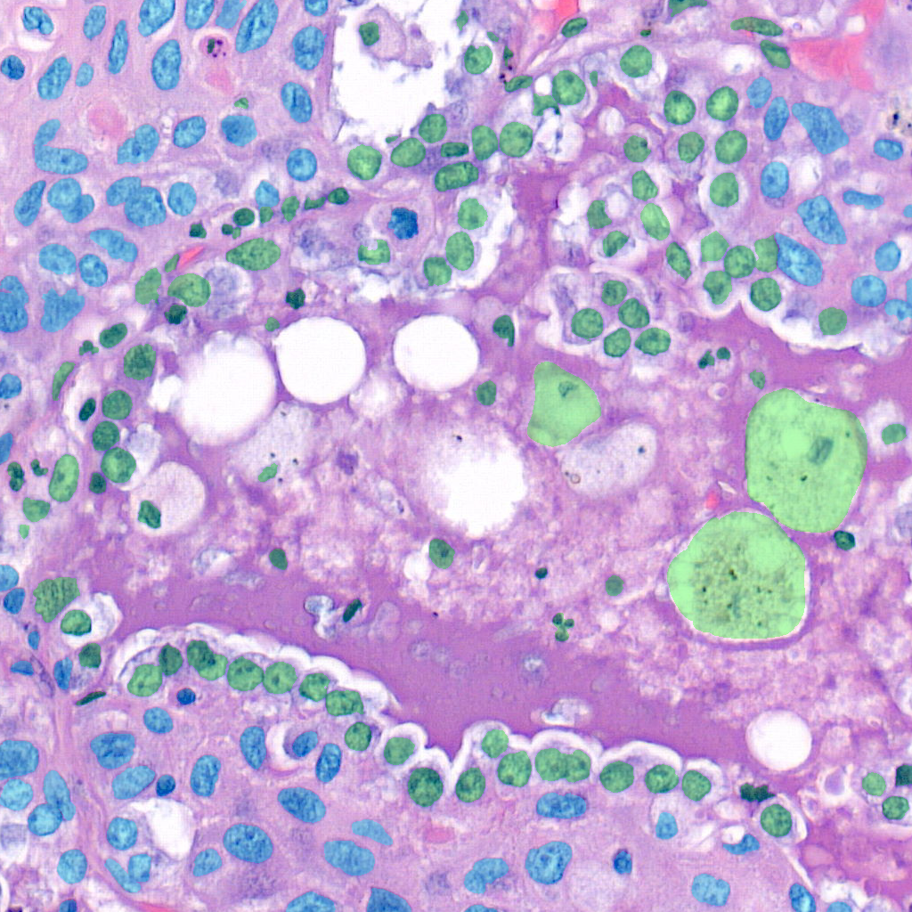

The command for that is

.. code-block:: console

    $ draw_cells --orig-dir ORIG_DIR --png-dir PNG_DIR --csv-dir CSV_DIR --output-dir OUTPUT_DIR --type-info TYPE_INFO

You must provide the directory location of the images in orig-dir and the predicted cells in PNG<->CSV format.
It is also needed to provide a file with the colors you want for the cells which is the type-info parameter.
You can find an example of such file at :code:`root-folder/weights/segmentation/hovernet/type_info.json`.

Overlay graph
^^^^^^^^^^^^^

If you want to further visualise what is happening you can also add the graph on top like so:

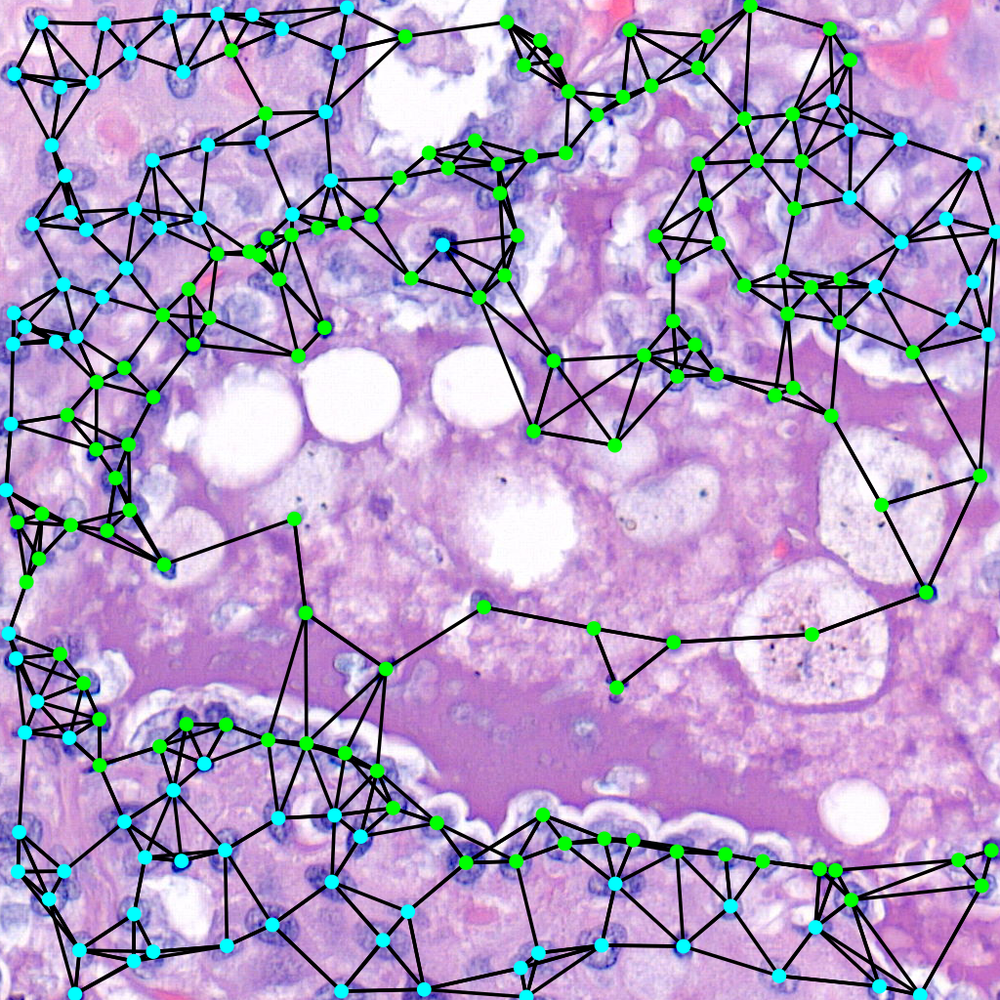

The command for that is:

.. code-block:: console

    $ draw_graph --orig-dir ORIG_DIR --png-dir PNG_DIR --csv-dir CSV_DIR --output-dir OUTPUT_DIR --type-info TYPE_INFO --num-workers NUM_WORKERS --max-degree MAX_DEGREE --max-distance MAX_DISTANCE

Parameters here means the same as in the above command but there are two extra important parameters.
The max-degree parameter limits the maximum degree of each node in the graph.
The max-distance parameter control the maximums distance between any two cells to have an edge connecting them.

Vietoris-Rips Filtration
^^^^^^^^^^^^^^^^^^^^^^^^

Another way to visualize the topology of the graph is to use a Vietoris-Rips filtration:

|pic1| |pic2| |pic3|

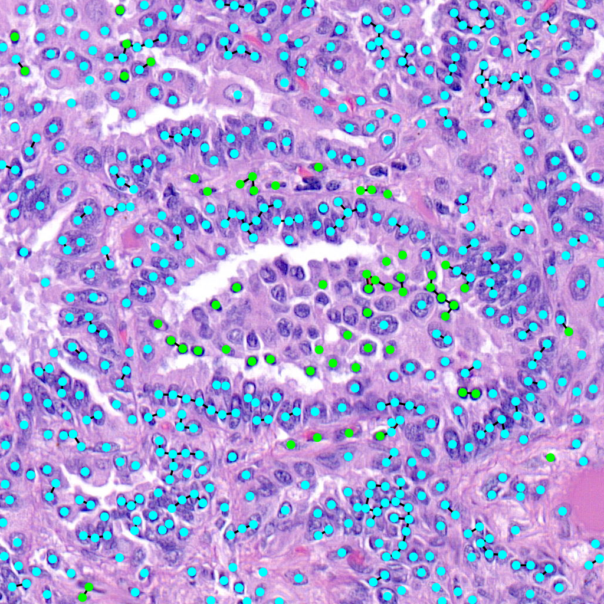

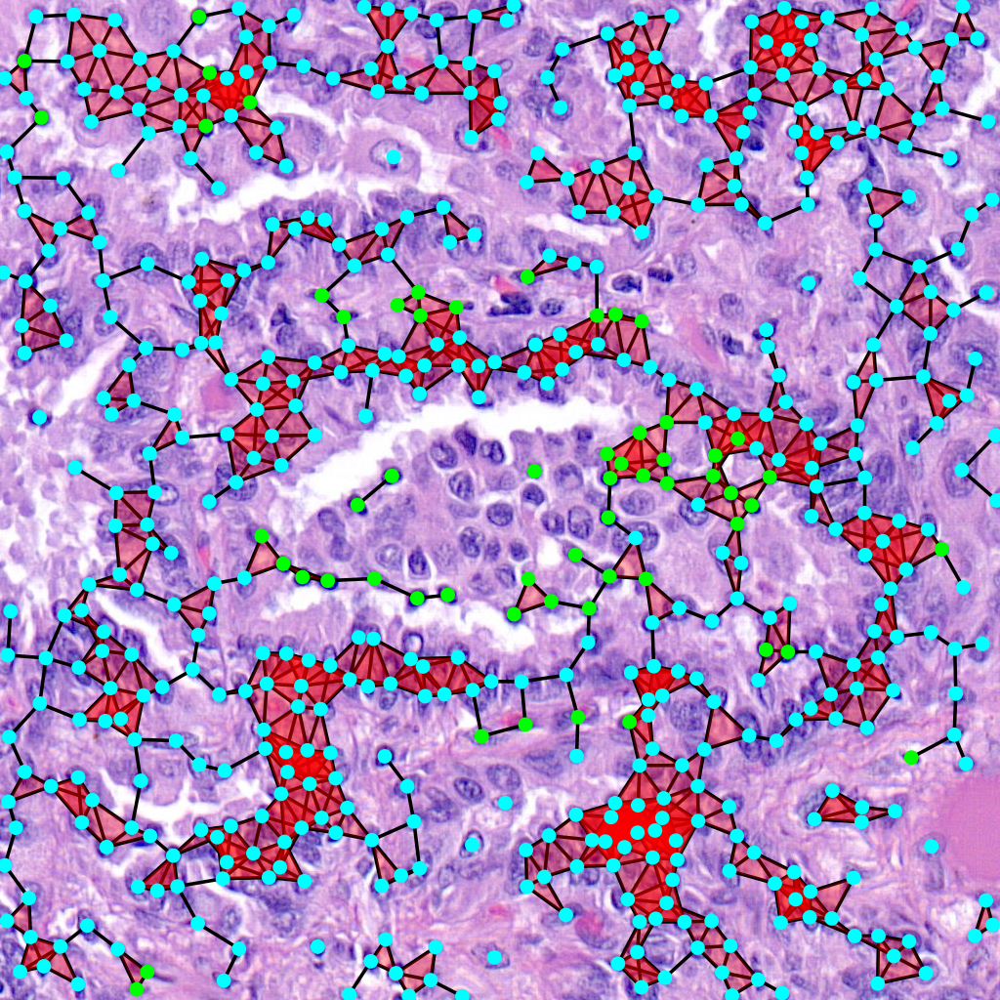

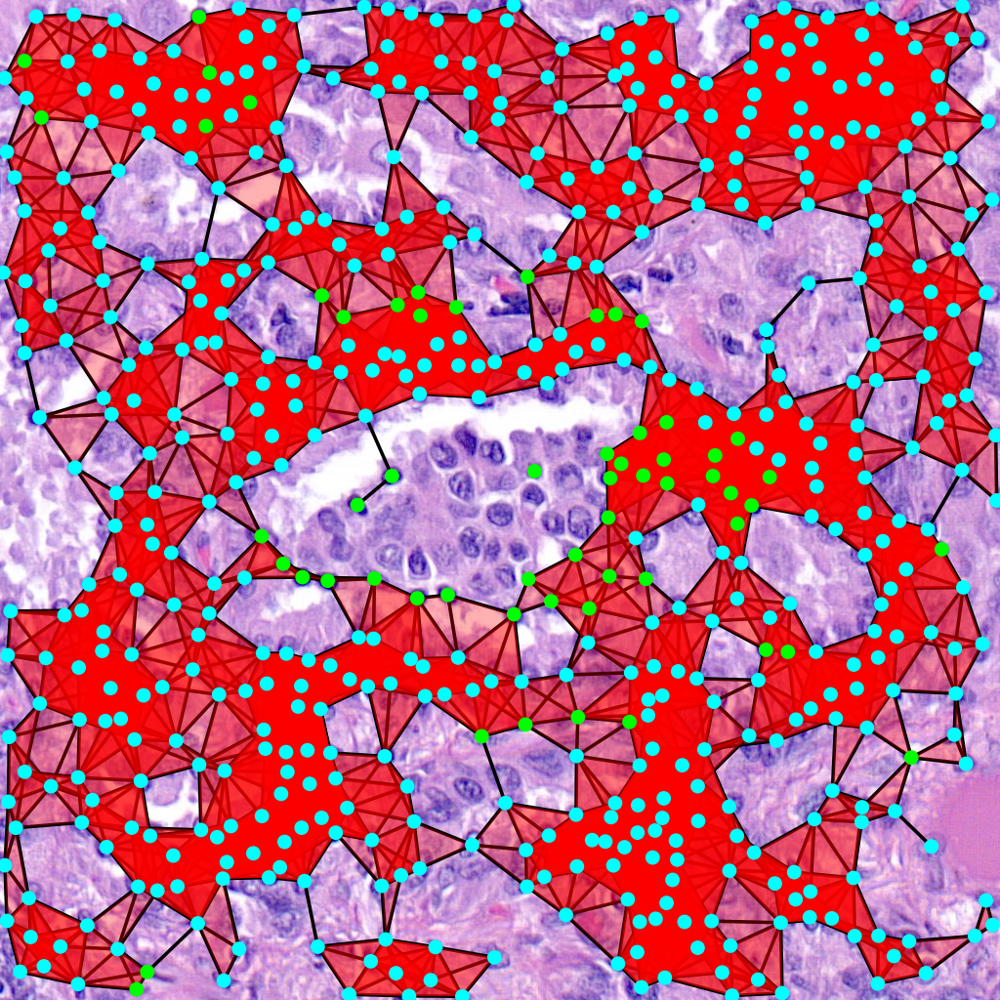

The command for that is:

.. code-block:: console

    $ draw_rips --orig-dir ORIG_DIR --png-dir PNG_DIR --csv-dir CSV_DIR --output-dir OUTPUT_DIR --type-info TYPE_INFO --num-workers NUM_WORKERS --max-degree MAX_DEGREE --max-distance MAX_DISTANCE [--use-metric]

Parameters here means the same as in the above command but there is one extra important parameter.
When --use-metric is activated the filtration is made using euclidean distance, otherwise it uses graph distance.

Persistence Diagrams
^^^^^^^^^^^^^^^^^^^^

Given the above filtration one can compute the persistence diagram to obtain topological information:

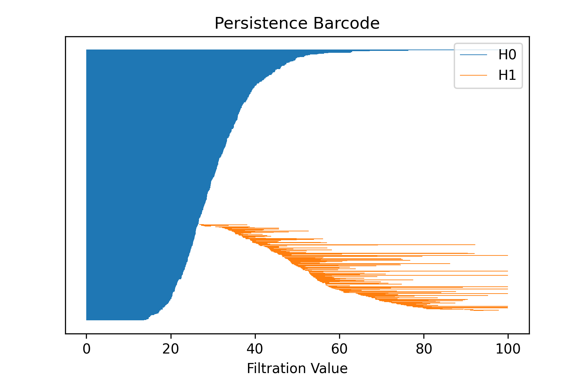

The command for that is:

.. code-block:: console

    $ draw_barcode --orig-dir ORIG_DIR --png-dir PNG_DIR --csv-dir CSV_DIR --output-dir OUTPUT_DIR --num-workers NUM_WORKERS --max-degree MAX_DEGREE --max-distance MAX_DISTANCE [--use-metric]

Parameters here means the same as in the above command.
The zero dimensional barcode encodes information of connected components as well as the distances of the minimum spanning tree edge lengths.
One dimensional barcode is related to the loops and second dimensional to 2D loops, which are spheres.
No higher dimensional information is computed. The result is also saved in a csv file.

To compare diagrams there is also another command that computes q-Wassertein and Bottleneck distances:

.. code-block:: console

    $ compare_barcodes --barcode1 PATH1 --barcode2 PATH2 [--output_path OUTPUT_PATH] [-q Q] [--homology-dim D]
