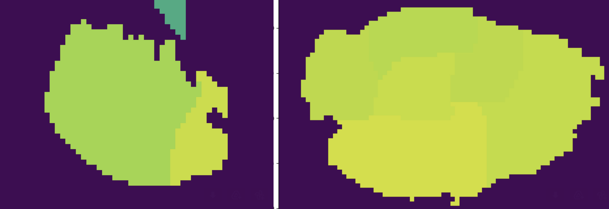
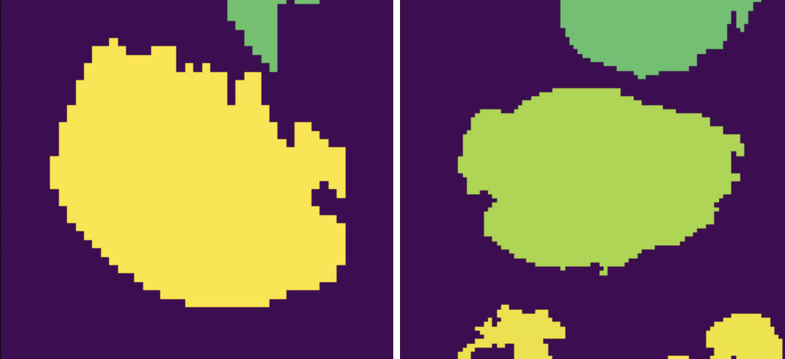

Usage
=====

If you haven't installed the library yet, check out the :doc:`installation` section for further information.

Entry points
------------

Once you have installed the library several commands will be made available in the shell. The most important ones are:

* :code:`make_dirs`: It will create an internal directory structure where all the magic is going to happen. More info :ref:`below <make_dirs>`.
* :code:`run_training`: It will train the segmentation and classification models sequentially. More info :ref:`below <run_training>`.
* :code:`run_inference`: It will execute the pipeline on previously unseen images. More info :ref:`below <run_inference>`.

They all require some parameters to be specified. You can get the parameter names and a brief description by calling the commands together with the flag :code:`-h` or :code:`--help`.

There are more commands available, for a comprehensive list look in the :ref:`section at the end <preproc_utils>`.

.. _make_dirs:

make_dirs
^^^^^^^^^

There are many data formats that need to be handled during training. And model weights also need to be located somewhere.
To avoid moving objects around and keep everything organized, a strict folder structure is enforced, and it looks like what follows.

::

    root-folder
    ├── data
    │   ├── orig
    │   ├── train
    │   │   ├── centroids
    │   │   ├── gson
    │   │   ├── json
    │   │   ├── png
    │   │   ├── csv
    │   │   ├── graphs
    │   │   |   ├── raw
    │   │   |   ├── GT
    │   │   |   └── preds
    │   │   └── npy
    │   ├── test
    │   │   ├── ...
    │   └── validation
    │       ├── ...
    └── weights
        ├── classification
        |   ├── automl
        |   ├── xgb
        |   └── gnn
        │       ├── conf
        │       ├── normalizers
        │       └── weights
        └── segmentation
            └── hovernet
                └── type_info.json

Keep in mind throughout the whole process that the parameter :code:`--num-classes` must be specified always. 
Here it is responsible for creating the correct :code:`type_info.json` which contains needed information for hovernet to classify in the number of classes you specify. 

Once you have created that structure, you must move all your original tiles to :code:`data/orig` and the geojson files to :code:`data/gson`. 
That is enough for the pipeline to proceed. If your labels don't come from QuPath and don't have a geojson format, you will need to convert whatever format you have to the geojson format first. 
For more details on how to do so, go to :ref:`the last section <preproc_utils>`.

.. _run_training:

run_training
^^^^^^^^^^^^

Now that everything is set up, you can begin training the models. The corresponding command is

.. code-block:: console
   
   $ run_training --root-dir [...] --pretrained-path [...] --num-classes 2 --gpu 0 --num-workers 10

Here you need to specify two main parameters: :code:`--root-dir` and :code:`--pretrained-path`. The first one is the root folder specified on the previous section. 
The second is the path to the weights you want your hovernet model to start with. The original hovernet models can be found in the `drive <https://drive.google.com/drive/folders/17IBOqdImvZ7Phe0ZdC5U1vwPFJFkttWp>`_ 
of the original `repository <https://github.com/vqdang/hover_net>`_. Right now, the pipeline is designed to work with the :code:`hovernet_original_consep_type_tf2pytorch.tar` checkpoint.

The other parameters are computational parameters. They indicate in which gpu id to execute the models and how many threads to use in the parts which are parallelized, mainly preprocessing and postprocessing functions.

.. _run_inference:

run_inference
^^^^^^^^^^^^^

After you have trained your models, you may want to predict new labels for previously unseen images. To do so, just execute the following

.. code-block:: console
   
   $ run_inference --root-dir [...] --input-dir [...] --output-dir [...] --best-arch [...] --num-classes 2 --gpu 0 --num-workers 10

The parameters :code:`--input-dir`, :code:`--output-dir` indicate where the input images are, and where to save the results. If the indicated folder does not exists, it is created. 
Be careful, whatever is in the folder will be overwritten.

The remaining parameter :code:`--best-arch` indicates which graph architecture has been used. Right now it only supports GCN. You will also see that this command 
has more parameters. The rest of the parameters make reference to hyperparameters of the graph neural network. However, you can simply choose the combination 
that was best in validation and test while training by not specifying them. Also, if you specify a combination of hyperparameters that was not used during 
training, it will not work.

.. _preproc_utils:

Format conversion
^^^^^^^^^^^^^^^^^

When working with patches of whole slide images, the labels can be represented in two main formats:

* **PNG <-> CSV**: This is the standard format for instance segmentation where every cell has an identifier. In the image (PNG) every pixel has the value of that identifier and in a separate table (CSV) each identifier has associated one class. The classes are numbered from 1 to C, being C the number of classes. And the ID 0 is reserved for the background.
* **GeoJSON**: This is the format used in the QuPath program that can be used for labelling the images. It is a standard geojson format where the geometry describes the contours of the cells and in the properties attribute is included the class of the cell.

Apart from those two formats there are other three formats storing additional information:

* **.centroids.csv**: For evaluation purposes the centroids of the cells are precomputed and stored as a table (CSV) with the columns X, Y and class.
* **Hovernet JSON**: The output of the hovernet model comes with a JSON that has extra information like the position of the centroids or the contours that is quite handy.
* **Hovernet npy**: The format of the input to hovernet. Basically images with 5 channels: Red, Green, Blue, segmentation and classification.

There is yet another format for storing graph nodes:

* **.nodes.csv**: Stores extracted attributes of cells and saves them in a csv. Current attributes are: (X,Y) center of bounding box, area, perimeter, gray level variance and RGB histogram. Apart from morphological attributes, the probabilities of each class from hovernet prediction are also given as attributes.

In order to convert from any format to any format, several commands are provided by this library:

* :code:`geojson2pngcsv`: To convert from GSON to PNG / CSV.
* :code:`pngcsv2geojson`: To convert from PNG / CSV to GSON.
* :code:`pngcsv2centroids`: To compute centroids form PNG / CSV format.
* :code:`pngcsv2graph`: To compute the node centroids and attributes from PNG / CSV and original tiles.
* :code:`hovernet2geojson`: To convert from JSON to GSON.
* :code:`hovernet2centroids`: To extract centroid information from JSON.
* :code:`centroids2png`: To create images with pixel value 255 at the centroids coordinates.
* :code:`graph2centroids`: To extract centroids from the .nodes.csv files.
* :code:`centroidspng2csv`: To obtain CSV labels from centroids labels and PNG segmentation.

The last two commands are needed to convert from the graph format back to the PNG / CSV format. Each of them has specific parameters. 
To get an explanation of what parameters are needed run the commands with the :code:`-h` or :code:`--help` flags.

In case you want a more in depth explanation of the code that is being executed under the hood, please refer to the :doc:`API reference <_autosummary/tumourkit>`.

Merge cells
^^^^^^^^^^^

The segmentations produced by Hovernet tend to split cells in half sometimes. This library provides an algorithm to merge broken cells.
If we have a situation like in the image below.

The algorithm would merge the parts like this.

To apply this algorithm to a set of labels call it with this command.

.. code-block:: console
   
   $ merge_cells --png-dir [...] --csv-dir [...] --output-path [...]

The two first arguments indicate the input in PNG / CSV format, and the last one is the folder to save the result. 
Two subfolders will be created under it called postPNG and postCSV containing the new PNG / CSV files.
